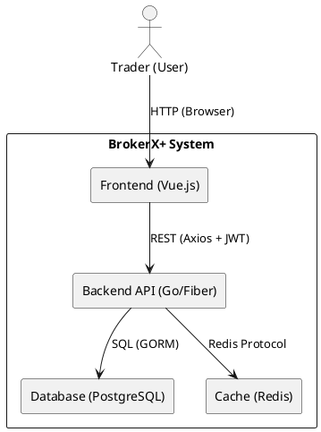
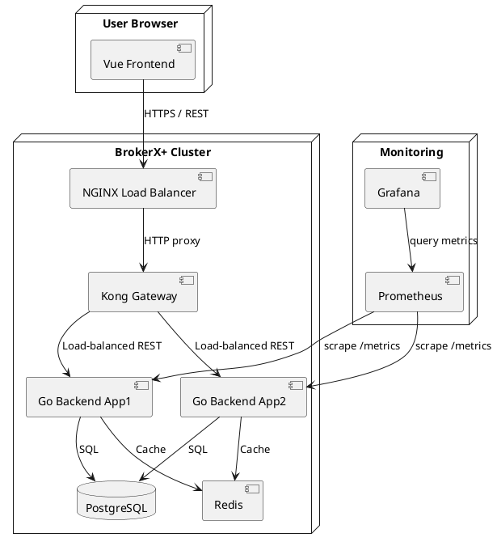
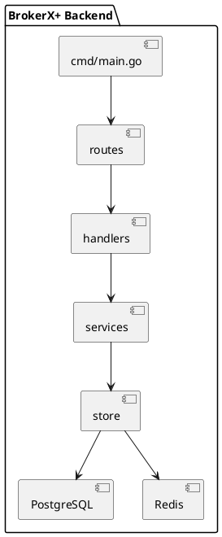
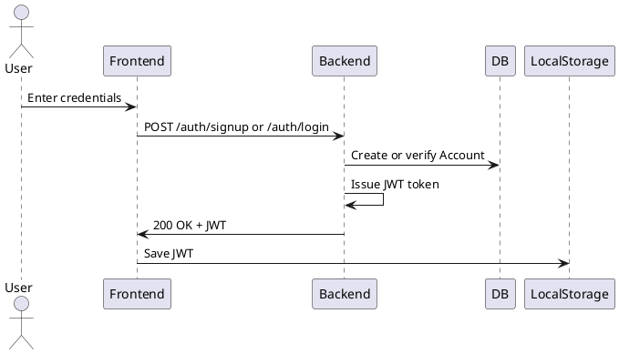
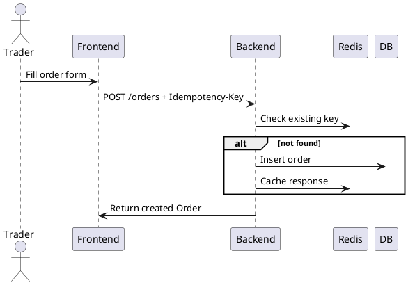
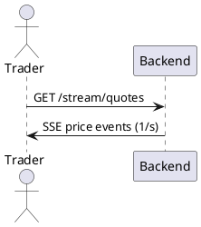
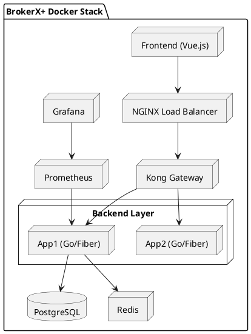

# BrokerX+ Phase 2 – Full Arc42 Architecture Documentation (Go Edition)

---

## 1. Introduction and Goals

**System name:** BrokerX+  
**Version:** Phase 2 (Go/Fiber)

BrokerX+ is a prototype of an online brokerage platform developed as part of the LOG430 course. It simulates an end-to-end financial trading system that allows users to create accounts, authenticate, place stock orders, retrieve portfolio data, and receive simulated real-time market quotes.

### Primary Goals
- Deliver a **functional prototype** aligned with the _Cahier des charges_ requirements.
- Showcase a **distributed, containerized architecture** with observability and security.
- Implement **REST APIs** with **JWT authentication**, idempotency, caching, and load balancing.
- Provide a working **frontend prototype** with real-time quote streaming.

### Quality Attributes
| Attribute | Description |
|------------|-------------|
| **Performance** | Fast, low-latency API responses (<200 ms typical). |
| **Scalability** | Horizontal scaling via NGINX and Docker Compose replicas. |
| **Availability** | Multi-instance redundancy for backend services. |
| **Security** | JWT authentication, HTTPS routing (future), and rate limiting. |
| **Observability** | Metrics exposed via Prometheus, visualized in Grafana. |
| **Reproducibility** | Entire system deployable in <30 minutes via Docker Compose. |

---

## 2. Constraints

- **Academic constraint:** Must run locally with Docker Compose and without external SaaS dependencies.
- **Technology constraint:** Go and Vue.js chosen for rapid, modern development.
- **Infrastructure constraint:** All services (DB, cache, gateway, monitoring) containerized.
- **Security constraint:** No third-party auth (e.g., Clerk/Auth0) allowed for reproducibility.
- **Time constraint:** Deliver within limited semester timeline.

---

## 3. Context and Scope

The system exposes a REST API to manage user accounts, orders, and quotes. It communicates with internal components (PostgreSQL, Redis) and external clients (the web frontend).



---

## 4. Solution Strategy

### 4.1 Backend – Go (Fiber Framework)
- High performance and low footprint.
- Excellent for containerized deployment.
- Built-in middleware (CORS, logger, recover) ensures production-ready robustness.

### 4.2 Frontend – Vue 3 (Vite)
- Reactive, lightweight, and easy to integrate with REST APIs.
- JWT token handling via Axios.

### 4.3 Data Layer – PostgreSQL + Redis
- **PostgreSQL** stores persistent entities (Accounts, Orders, Ledgers, Audits).
- **Redis** provides caching and **idempotency key** enforcement.

### 4.4 Networking & Routing
- **NGINX** load balances requests across backend instances using `least_conn`.
- **Kong Gateway** applies rate limiting and CORS policies.

### 4.5 Observability Stack
- **Prometheus** scrapes application metrics from `/metrics` endpoint.
- **Grafana** visualizes performance dashboards.

---

## 5. Building Block View

### 5.1 Container View



### 5.2 Component View (Backend)



---

## 6. Runtime View

### 6.1 Signup / Login Flow


### 6.2 Place Order Flow


### 6.3 Quote Streaming


---

## 7. Deployment View

### 7.1 Infrastructure Overview



### 7.2 Docker Compose Integration
Key services from `docker-compose.yml`:
```
services:
  app1, app2: build ./backend
  postgres: image postgres:16
  redis: image redis:7
  frontend: build ./frontend
  nginx: image nginx:alpine
  kong: image kong:3.6
  prometheus, grafana: monitoring stack
```

---

## 8. Cross-cutting Concepts

| Concept | Description |
|----------|-------------|
| **Authentication** | JWT (HS256) with expiration; bcrypt for password hashing. |
| **Authorization** | Role claim in JWT (future). |
| **Validation** | Go structs validated before DB persistence. |
| **Caching** | Redis used for idempotency + order replay protection. |
| **Error Handling** | Global Fiber `recover` middleware. |
| **Logging** | Request logs via `logger` middleware. |
| **Metrics** | `/metrics` endpoint integrated via `fiberprometheus`. |
| **CI/CD** | Local Docker builds; future GitHub Actions pipeline possible. |

---

## 9. Architecture Decisions (ADRs)

**ADR-001 – Backend Language**  
Decision: Use Go with Fiber v2.  
Rationale: Lightweight, performant, easy to containerize.  
Alternatives: Python (Flask/FastAPI) rejected due to slower concurrency.

**ADR-002 – Frontend Framework**  
Decision: Vue 3 with Vite.  
Rationale: Simple reactivity and tight integration with REST APIs.

**ADR-003 – Authentication**  
Decision: Local JWT with bcrypt.  
Rationale: Reproducibility and offline operation.  
Rejected: Clerk/Auth0 (external SaaS).

**ADR-004 – Database**  
Decision: PostgreSQL with GORM ORM.  
Rationale: Strong consistency and relational modeling.  
Alternatives: SQLite (too limited), MongoDB (inconsistent for ACID needs).

**ADR-005 – Cache & Idempotency**  
Decision: Redis for caching and idempotent order submissions.

**ADR-006 – Gateway & Load Balancing**  
Decision: Kong + NGINX.  
Rationale: NGINX for internal LB, Kong for external rate limiting.

**ADR-007 – Observability**  
Decision: Prometheus/Grafana stack.  
Rationale: Full metrics visibility and academic reproducibility.

**ADR-008 – Deployment**  
Decision: Docker Compose multi-container architecture.  
Rationale: Simple local orchestration.  
Future: Kubernetes possible.

**ADR-009 – Security**  
Decision: Basic rate limiting and CORS control via Kong.  
Rationale: Protects API from abuse.

**ADR-010 – Development Strategy**  
Decision: Go modular code with `cmd`, `internal` structure.  
Rationale: Scalable, maintainable layout.

**ADR-011– Development Strategy**  
Decision: Backend deployed twice using `app1` and `app2`
Rationale: Redundence

---

## 10. Quality Requirements

### 10.1 Performance Scenario
- Under 100 concurrent users, API latency <200 ms (95th percentile).
- Achieved via Fiber efficiency, Redis caching, and load balancing.

### 10.2 Reliability Scenario
- Two backend replicas ensure availability if one crashes.

### 10.3 Scalability Scenario
- NGINX scales to any number of replicas via Compose.

### 10.4 Observability Scenario
- Prometheus scrapes metrics; Grafana dashboards show latency, RPS, and error rates.

### 10.5 Maintainability
- Modular structure allows independent evolution of handlers, services, and store layers.

---

## 11. Risks and Technical Debt

| Risk | Impact | Mitigation |
|------|---------|------------|
| Order Matching Logic Simplified | Medium | Extend with true matching engine later. |
| JWT Secret in `.env` | High | Use secrets manager or environment variables. |
| No HTTPS | Medium | Terminate TLS via SWAG or NGINX in production. |
| Redis Persistence | Low | Use RDB/AOF backups if required. |
| Missing E2E Tests | Medium | Integrate `k6` and Postman testing. |

---

## 12. Glossary and References

| Term | Definition |
|------|-------------|
| **ADR** | Architecture Decision Record |
| **JWT** | JSON Web Token |
| **SSE** | Server-Sent Events (real-time updates) |
| **LB** | Load Balancer |
| **CI/CD** | Continuous Integration / Continuous Deployment |

**References:**  
- LOG430 – Cahier des charges (2025)  
- Go Fiber documentation  
- Kong Gateway configuration guide  
- Prometheus & Grafana official docs  
- Docker Compose Specification


## UC Must
### UC-01 — Registration and Account Activation
Registration is used to create a new account on the platform. The user enters their email and a password, and the system creates an account in a pending state. An activation token is generated, and the user must validate it in order to activate their account.
Without completing this step, the user cannot use the platform.

### UC-02 — Authentication (Login)
Login allows a registered user to access their account. The user enters their email and password, and if the information is correct and the account is active, the system issues a session token. This token allows the user to securely use the platform’s features.

### UC-03 — Virtual Deposit
The virtual deposit feature allows the user to add simulated funds to their account. The user specifies an amount, and the system adds it to their account balance. A special key is used to ensure that the same deposit cannot be counted more than once.

### UC-04 — Market Data Subscription
This feature allows users to receive real-time market prices and order book updates for selected symbols. When the user opens the market view or subscribes to certain instruments, the system checks that the session is valid and then opens a live data stream (WebSocket or SSE). The user continuously receives price updates and order book changes with low latency.
If the data source is unavailable or the update rate is too high, the system switches to a reduced update mode and may display a notice that data is delayed.

### UC-05 — Placing an Order
Placing an order means submitting a request to buy or sell a security. The user selects the symbol, the type of order, the quantity, and optionally a limit price. The system verifies that the user has sufficient funds and then records the order. If a matching counterparty order exists, the trade is executed; otherwise, the order remains pending.


## Note
Please note that the backend was developed with significant assistance from SIAG, as I am not familiar with the GO programming language. It was chosen due to its performance and lightweight nature.

---


